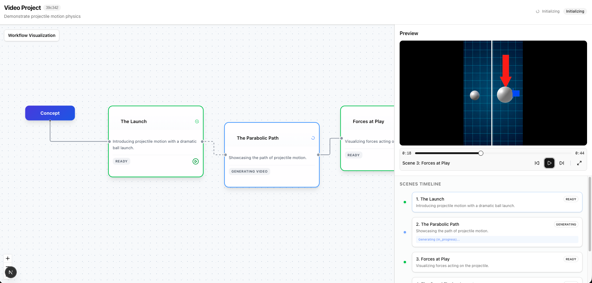

# Cursor Video Platform

**Transform your ideas into educational videos with AI-powered video generation.**

Cursor Video Platform is an intelligent video creation tool that automatically generates multi-scene educational videos from a simple text prompt. Using advanced AI model, it plans scenes, generates visuals, and produces ready-to-use video content all in minutes.



## 🎯 Problem It Solves

Creating educational or explainer videos traditionally requires:
- **Time-consuming production**: Hours of scripting, filming, and editing
- **Technical expertise**: Video editing software knowledge and design skills
- **Resource costs**: Hiring videographers, animators, or purchasing stock footage
- **Iteration challenges**: Making changes requires re-editing entire sequences

**Cursor Video Platform solves this by:**
- ✅ **Instant video generation** from text descriptions
- ✅ **Automatic scene planning** with AI-powered storyboarding
- ✅ **Professional-quality visuals** using OpenAI's Sora video generation
- ✅ **Real-time progress tracking** so you know what's happening
- ✅ **Easy iteration** - regenerate individual scenes without starting over

## ✨ Features

### 🎬 Intelligent Scene Planning
The AI analyzes your prompt and automatically breaks it down into logical, sequential scenes with detailed visual descriptions.

### 🎨 AI-Powered Video Generation
Each scene is generated using OpenAI's Sora model, producing high-quality video content that matches your vision.

### 📊 Real-Time Workflow Visualization
Watch your video come together in real-time with an interactive workflow graph showing each scene's generation status.

### 🎥 Seamless Video Playback
Preview your complete video with a built-in player that seamlessly transitions between scenes.

### 🔄 Scene Reordering
Drag and drop scenes in the workflow visualizer to reorder them—perfect for refining your narrative flow.

## 🛠️ Technology Stack

### Backend
- **FastAPI** - Modern Python web framework for building APIs
- **LangGraph** - Orchestrates the AI workflow for scene planning and generation
- **LangChain** - Integrates with OpenAI for intelligent scene planning
- **OpenAI Sora API** - State-of-the-art video generation model
- **MongoDB** (via Motor) - Stores projects, scenes, and metadata
- **WebSockets** - Real-time progress updates to the frontend
- **Python 3.9+** - Core backend language

### Frontend
- **Next.js 16** - React framework with App Router
- **TypeScript** - Type-safe development
- **React Flow** - Interactive workflow visualization
- **Zustand** - Lightweight state management
- **Tailwind CSS** - Utility-first styling
- **Shadcn UI** - Beautiful, accessible component library
- **WebSockets** - Real-time communication with backend

### AI & ML
- **OpenAI GPT-4o** - Scene planning and creative direction
- **OpenAI Sora** - Video generation (models: `sora-2`, `sora-2-pro`)

## 🚀 Getting Started

### Prerequisites

- **Python 3.9+** installed
- **Node.js 18+** and npm installed
- **MongoDB** running locally (default: `mongodb://localhost:27017`)
- **OpenAI API Key** with access to Sora video generation API

### Installation

1. **Clone the repository**
   ```bash
   git clone <repository-url>
   cd cursor-for-video
   ```

2. **Set up the backend**
   ```bash
   cd backend
   python -m venv venv
   source venv/bin/activate  # On Windows: venv\Scripts\activate
   pip install -r requirements.txt
   ```

3. **Configure environment variables**
   
   Create a `.env` file in the `backend` directory:
   ```env
   OPENAI_API_KEY=your_openai_api_key_here
   OPENAI_VIDEO_MODEL=sora-2
   MONGODB_URL=mongodb://localhost:27017
   DATABASE_NAME=cursor_video
   STORAGE_DIR=storage
   ```

4. **Set up the frontend**
   ```bash
   cd frontend
   npm install
   ```

5. **Configure frontend environment**
   
   Create a `.env.local` file in the `frontend` directory:
   ```env
   NEXT_PUBLIC_API_URL=http://localhost:8000/api
   NEXT_PUBLIC_WS_URL=ws://localhost:8000/api/ws
   ```

### Running the Application

Simply run the startup script:

```bash
./start.sh
```

This will start both the backend (on `http://localhost:8000`) and frontend (on `http://localhost:3000`).

**Or run manually:**

**Terminal 1 - Backend:**
```bash
cd backend
source venv/bin/activate
uvicorn app.main:app --reload --port 8000
```

**Terminal 2 - Frontend:**
```bash
cd frontend
npm run dev
```

## 📖 How to Use

1. **Create a Project**
   - Enter a description of the video you want to create (e.g., "Explain projectile motion with visual demonstrations")
   - Click "Generate Video"

2. **Watch the Magic Happen**
   - The AI plans your scenes automatically
   - Each scene generates in parallel with real-time progress updates
   - Monitor progress in the workflow visualizer

3. **Review & Refine**
   - Preview scenes as they complete
   - Reorder scenes by dragging them in the workflow graph
   - Watch the full video in the integrated player

4. **Export**
   - Videos are saved locally in the `backend/storage/{project_id}/` directory
   - Access them via the `/media/{project_id}/scene_{index}_{uuid}.mp4` URL

## 🎨 Example Prompts

- "Explain the Pythagorean theorem with a visual proof"
- "Visualize how bubble sort algorithm works step by step"
- "Show projectile motion physics with a cannonball demonstration"
- "Demonstrate the water cycle with animated diagrams"

## 📁 Project Structure

```
cursor-for-video/
├── backend/
│   ├── app/
│   │   ├── api/          # REST API routes
│   │   ├── core/         # Configuration and prompts
│   │   ├── db/           # Database models and connection
│   │   ├── graph/        # LangGraph workflow definitions
│   │   ├── services/     # Video generation service
│   │   └── main.py       # FastAPI application entry point
│   ├── storage/          # Generated video files
│   └── requirements.txt
├── frontend/
│   ├── src/
│   │   ├── app/          # Next.js app router pages
│   │   ├── components/   # React components
│   │   ├── hooks/        # Custom React hooks
│   │   └── lib/          # Utilities and API client
│   └── package.json
└── Images/               # Screenshots and documentation images
```

## 🔧 Configuration

### Video Generation Settings

- **Model**: Choose between `sora-2` (faster) or `sora-2-pro` (higher quality) in your `.env`
- **Duration**: Videos are generated in 4, 8, or 12-second segments based on your project's target duration
- **Resolution**: Defaults to standard video resolution (configurable via Sora API)

### Customization

- Modify scene planning prompts in `backend/app/core/prompts.py`
- Adjust workflow logic in `backend/app/graph/nodes.py`
- Customize UI components in `frontend/src/components/`

## 🐛 Troubleshooting

**Videos not generating?**
- Ensure your OpenAI API key has access to Sora video generation
- Check that MongoDB is running and accessible
- Review backend logs for detailed error messages

**Frontend not connecting?**
- Verify `NEXT_PUBLIC_API_URL` matches your backend port
- Check WebSocket URL configuration
- Ensure CORS is properly configured (default allows all origins)

**Slow generation?**
- Video generation takes several minutes per scene (this is normal for Sora)
- Progress updates appear in real-time via WebSocket
- Consider using `sora-2` model for faster results (vs `sora-2-pro`)

## 📝 License

[Add your license here]

## 🤝 Contributing

[Add contribution guidelines here]

## 🙏 Acknowledgments

- OpenAI for Sora video generation API
- LangChain team for the LangGraph framework
- The open-source community for the amazing tools that made this possible

---

**Built with ❤️ using AI to make video creation accessible to everyone.**

